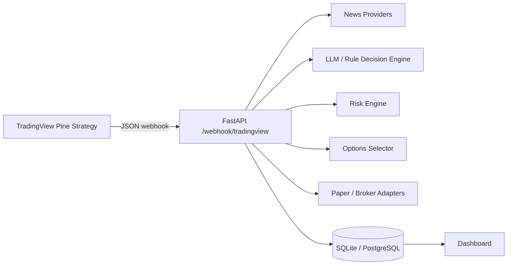

# SPY 0DTE AI-Assisted Scalping System

Production-oriented stack for **SPY options scalping** (0DTE / 1DTE) that uses **TradingView** for technical signals and webhooks, and an external **Python backend** to filter and score trade opportunities in real time using news, sentiment, regime, and strict risk rules before paper (or optional live) execution.

> Pine Script does **not** call LLMs or news APIs. It only generates technical setups and JSON alert payloads.

## Architecture



| Layer | Responsibility |
|--------|----------------|
| `pine/spy_0dte_scalper.pine` | EMA, VWAP, RSI, MACD, ATR, ORB, volume, session filters |
| `backend/` | Webhook ingest, normalize, persist, orchestrate |
| `ai/` | Headlines, sentiment, probabilistic APPROVE/REJECT/WAIT |
| `execution/` | Paper simulator + broker stubs (Alpaca, Tradier, IBKR) |
| `dashboard/` | Alerts, decisions, PnL, rejections, time-of-day analytics |

## Project structure

```text
/pine/spy_0dte_scalper.pine
/backend/main.py, routes/, services/, models/, schemas/
/ai/sentiment_engine.py, llm_decision.py, news_providers.py
/execution/paper_executor.py, broker_base.py, *_adapter.py
/dashboard/templates/, static/
/tests/
/docs/
.env.example
docker-compose.yml
```

## Quick start (local)

```bash
cd /workspace
python -m venv .venv
source .venv/bin/activate
pip install -r backend/requirements.txt
cp .env.example .env
mkdir -p data

export PYTHONPATH=/workspace
uvicorn backend.main:app --reload --host 0.0.0.0 --port 8000
```

Open http://localhost:8000 for the dashboard.

### Test webhook

```bash
curl -X POST http://localhost:8000/webhook/tradingview \
  -H "Content-Type: application/json" \
  -d @docs/sample_webhook.json
```

## Docker

```bash
cp .env.example .env
docker compose up --build
```

API: http://localhost:8000  
Health: http://localhost:8000/health

## TradingView setup (exact steps)

1. Open TradingView → **Pine Editor** → paste `pine/spy_0dte_scalper.pine` → **Add to chart** on **SPY** (intraday, e.g. 1m or 5m).
2. Click **Create Alert** on the chart.
3. Condition: strategy **SPY 0DTE Scalper** → choose alert on order fills or use the strategy’s `alert()` calls.
4. **Notifications** tab: enable **Webhook URL** and set:
   - `https://YOUR_HOST/webhook/tradingview`
   - For local dev use ngrok/cloudflared: `ngrok http 8000`
5. **Message** tab: use JSON. Either:
   - Use the strategy’s built-in `alert()` JSON (recommended), or
   - Paste a template from `docs/tradingview_alert_templates.json` with placeholders like `{{ticker}}`, `{{close}}`, `{{timenow}}`, `{{strategy.order.action}}`.
6. Ensure the message is **valid JSON** (TradingView substitutes placeholders at fire time).
7. Optional: add header `X-Webhook-Secret: <WEBHOOK_SECRET>` if you set `WEBHOOK_SECRET` in `.env`.

### Example webhook JSON (after placeholder expansion)

```json
{
  "ticker": "SPY",
  "time": "2026-05-19T10:05:00-04:00",
  "price": "502.35",
  "interval": "5",
  "action": "buy",
  "market_position": "long",
  "setup": "SPY_0DTE_SCALP",
  "bias": "bullish",
  "rsi": "58.5",
  "ema_fast": "502.10",
  "ema_slow": "501.40",
  "macd_state": "bullish",
  "volume_state": "spike",
  "vwap_state": "above",
  "atr": "1.12"
}
```

## Feature flags (`.env`)

| Variable | Default | Purpose |
|----------|---------|---------|
| `ENABLE_AI_FILTER` | `true` | Rule/LLM decision layer |
| `ENABLE_NEWS_FILTER` | `true` | Headline fetch + sentiment |
| `ENABLE_BROKER_EXECUTION` | `false` | Live broker routing |
| `EXECUTION_MODE` | `paper` | `paper` or `live` |
| `KILL_SWITCH` | `false` | Hard stop all approvals |
| `RISK_PRESET` | `standard` | `conservative` / `standard` / `aggressive` |

## Replay / backtest filter comparison

```bash
PYTHONPATH=/workspace python -m backend.scripts.replay --mode pine_only
PYTHONPATH=/workspace python -m backend.scripts.replay --mode pine_ai
PYTHONPATH=/workspace python -m backend.scripts.replay --mode pine_ai_risk
```

Compares raw Pine signals vs Pine + AI/news vs Pine + AI + risk engine using stored webhook payloads.

## Tests

```bash
PYTHONPATH=/workspace pytest -q
```

## Known limitations

- **TradingView** cannot execute options or call external APIs from Pine; latency and alert rate limits apply to webhooks.
- **0DTE options** need fast fills and accurate chain data; paper mode uses simulated quotes/spreads.
- **Live brokers** (Alpaca, Tradier, IBKR) are stubs until you implement chain lookup and order placement.
- **News/LLM** outputs are probabilistic filters, not guarantees; always use risk limits and paper trade first.
- **Session filters** in Pine (ET) and backend must stay aligned manually.
- Duplicate alert deduplication is in-memory by default; use Redis for multi-instance deployments.

## Related

Legacy IBKR MVP remains in `ibkr-llm-trading-assistant/` for reference.
